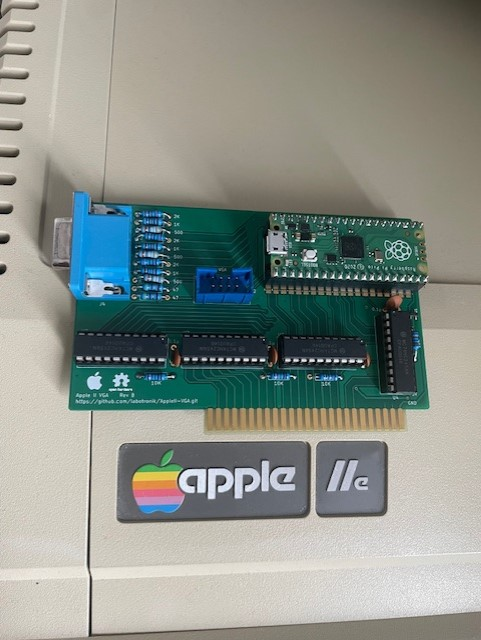
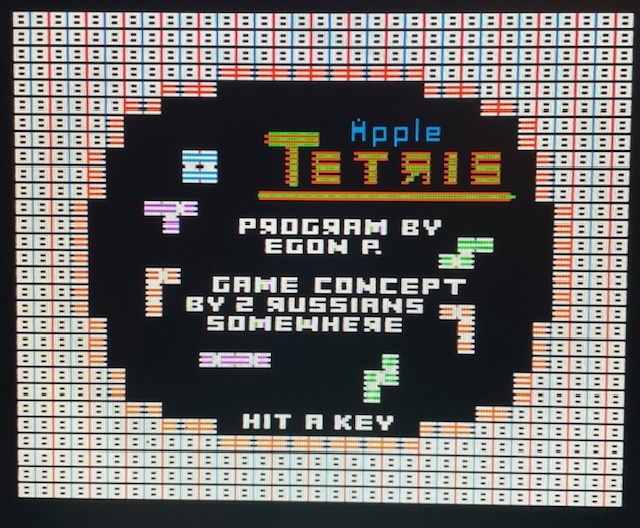
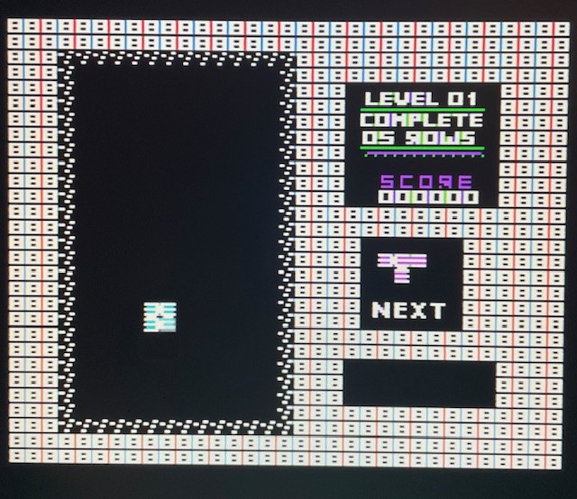
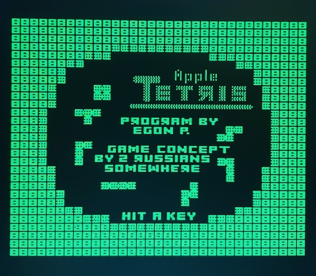
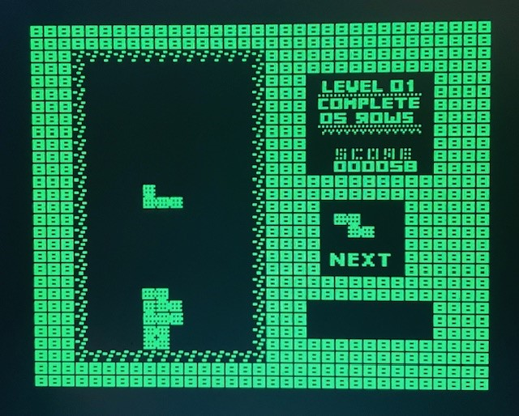

# NOTE
this project is forked from https://github.com/markadev/AppleII-VGA

**Main board**

This board add 2 VGA connectors, you can use the DB15 and/or the HE10 one.

**Connector board**
connected to HE10 connector (see AppleVGA-Connector directory for more information)

## Result on VGA monitor

You can use you AppleII VTA card in color mode 

 

or in monochrome mode

 

## Comparisons

Here are a few comparisons of the VGA card output vs composite video through
a cheap composite -> HDMI adapter

**Text**

**Lores**

**Hires**

**DHires**

**80 Columms**

